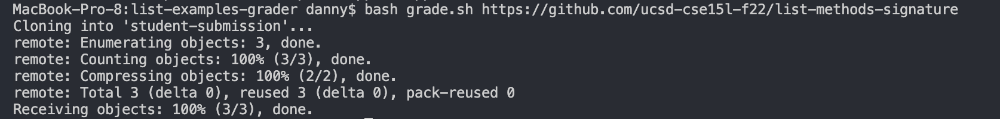

# Lab Report 5

* I have been trying but have not been able to get my autograder to work. I am going to go to office hours or consult with my lab partner to see if I can get some help. Here is the code.

* I first clone the student's code into the student-submission file and check if they actually have a file called ListExamples.java so that it can be graded. If the file does not exist, tell the student that and exit there. Then copy the test cases into the student-submission file and compile the JUnit tests. If the compile fails, then tell the student that there is a compile error and stop the grading. If there is no compile error, run the JUnit and copy the results into a file called output.txt. If there are any failures for the JUnit tests, the word failure will appear in output.txt. I used grep to copy any instances of the string failure into a new file called failures.txt. I checked if failures.txt was empty. If empty, the student passed all the tests. If not empty, the student did not pass all the tests.

* The problem occurs when there is a failure. The failure is not copied into failures.txt. This makes me think that the bug in my code has to do with line 27. I tried fixing this, but as I said I have had no luck. 
