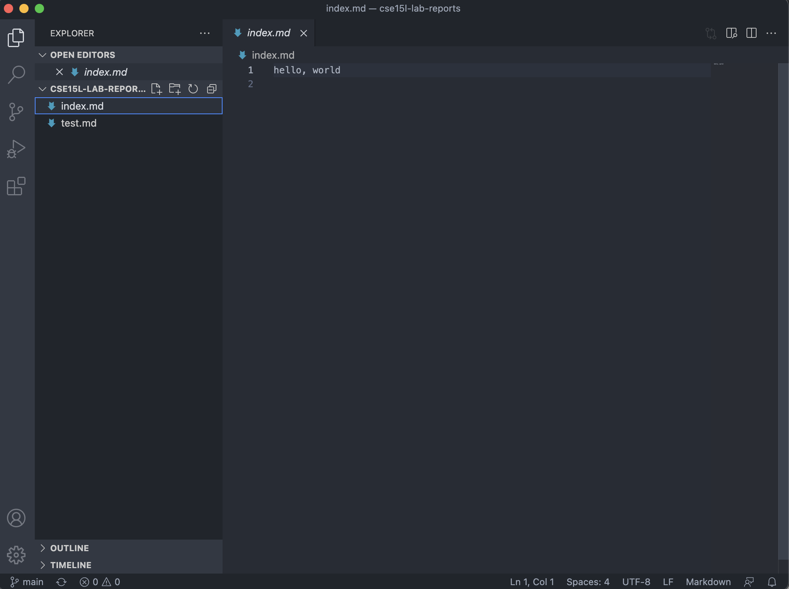

# lab report 1

First I downloaded github desktop and cloned my lab report repository from the github website.

Next, I was able to edit the markdown files in my lab report repository. I did this in vscode.

There is a tool in vscode that allows me to see how the markdown changes would look in a website.

After saving the changes on my local computer, I had to upload them onto my github account. I did this by clicking the commit to main button and the pushing the changes to the origin.

