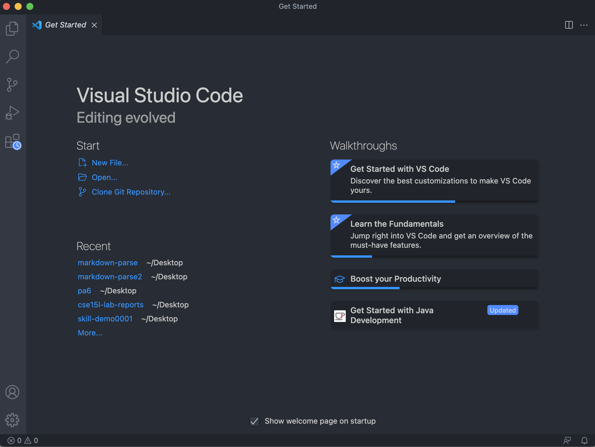
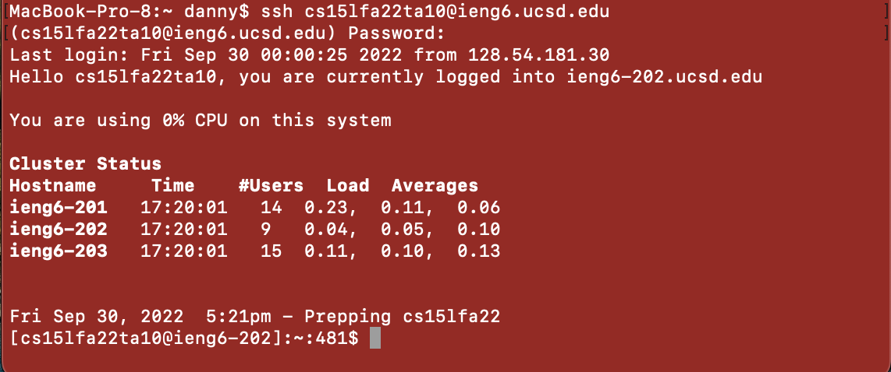
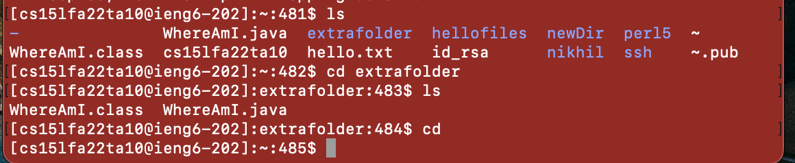
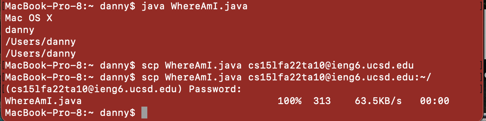

# week 1 lab report

## installing vscode

* I already had VSCode installed from a previous code. [This link](https://code.visualstudio.com/docs/setup/mac) provides instruction for installation on mac.

## remote connection

* To remotely connect to my account, I used `ssh` and the name of my account as the argument. I was then prompted for my password, which is the same one that I use for TritonLink. 

## Trying Some Commands

 * Here I tried some different commands inside of my ieng6 account. `cp` copied a file from a different public account. I then used `cat` to look at the contents. `ls` allowed me to look at the files and directories inside my current directory. `cd` allowed me to change to a different directory within the current directory. `cd` without an argument took me back to the home directory of my ieng6 account. 
 
 ## moving files with scp
 * First I compiled and ran WhereAmI on my computer.

* Then, I used `scp` to copy WhereAmI.java into my ieng6 account. After logging into my account, I was able to compile and run WhereAmI.java in my ieng6 account. 

## setting an ssh key

* I am having trouble logging into my own ieng6 account. 
