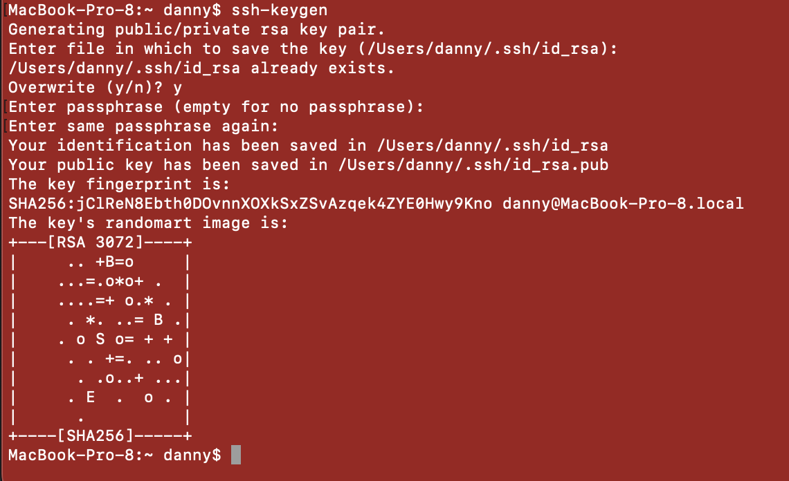
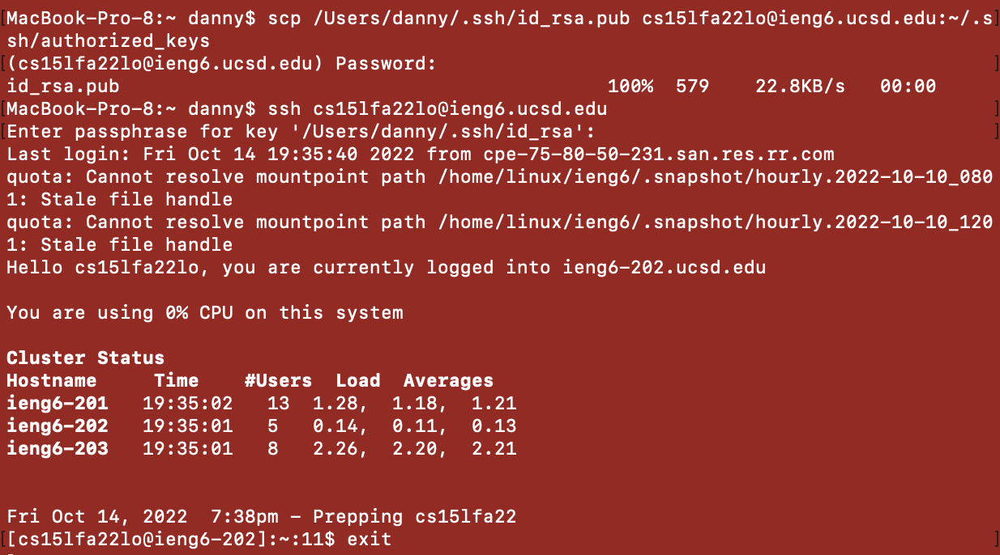
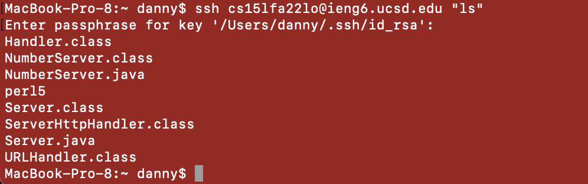

# week 1 lab report

## installing vscode

* I already had VSCode installed from a previous code. [This link](https://code.visualstudio.com/docs/setup/mac) provides instruction for installation on mac.

## remote connection

* To remotely connect to an account, I used `ssh` and the name of the account as the argument. 

## Trying Some Commands

 * Here I tried some different commands inside of my ieng6 account. `ls` allowed me to look at the files and directories inside my current directory. `cd` allowed me to change to a different directory within the current directory. `cd` without an argument took me back to the home directory of my ieng6 account. 
 
 ## moving files with scp
 * First I compiled and ran WhereAmI on my computer.

* Then, I used `scp` to copy WhereAmI.java into the ieng6 account. After logging into the account, I was able to compile and run WhereAmI.java in the ieng6 account. 

## setting an ssh key

* to create an ssh-key, I used the command `ssh-keygen`

* After copying the public key into my ieng6 account, I was able to log into my account without having to enter my very long password. 

* I am also able to run single commands on my remote account with ease now that I can use the key instead of entering my password every time. 

