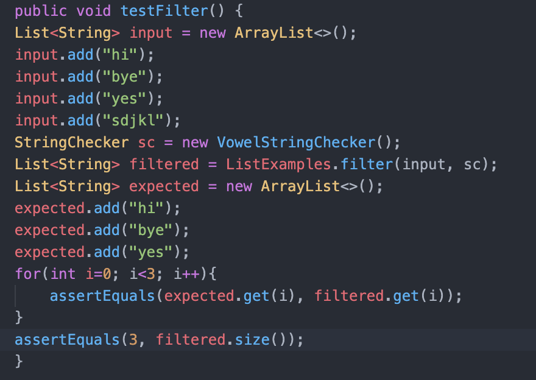
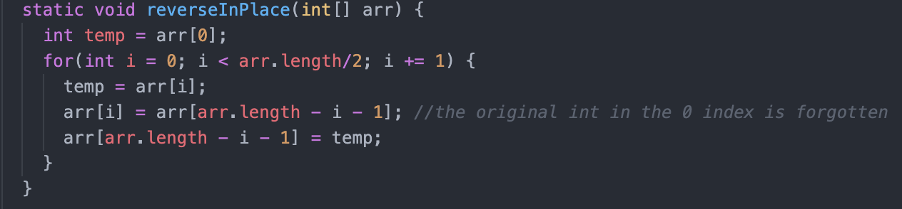

# week 3 lab report

## part 1: simplest search engine

* Whenever a query containing "/add" appeared, I would add whatever string the user puts into the strs arraylist. When a query containing "/search" appeared, I would iterate through strs to try to find any string that contains the string that the user input and I would return that string. If they put an invalid ath, then "404 Not Found!" would be displayed. 

## part 2: bugs

* This is my test for the filter method in the ListExamples.java file. 

 * I found that the first string in the list produced by the filter method was the one that should be last. I saw that the method correctly filtered out the string with no vowels, but put them in the new list in the wrong order. 

 * I found that in the original code, the strings were being added to the start of the new list. This caused the final list to be in reversed order. I fixed this by adding the strings onto the end of the list.

* This is the failure-inducing input for the reverseInPlace method in ArrayExamples.java

* I found that the value in the first index was the value that should be in the last index.

* There were two things wrong with the original code. First, when a value was put into the first spot from the last spot, the value that was originally in the first spot was forgotten. Second, even if the value in the first index was remembered and successfully transferred over to the last index, the for loop ran for too long. The list would be completely reversed after the for loop had iterated half the length of the array. Iterating the full length of the array would reverse the array back to how it originally was. Fixing both of these bugs made this method work according to the description. 

* 
