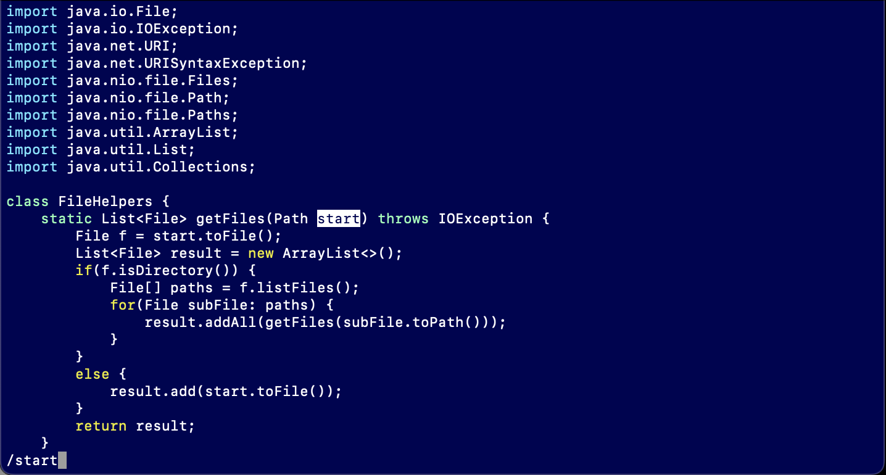
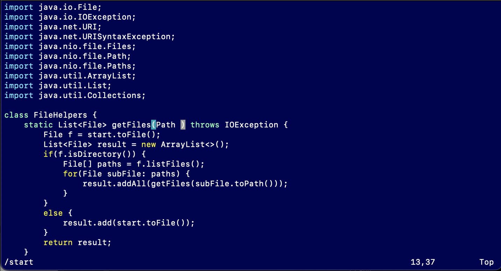
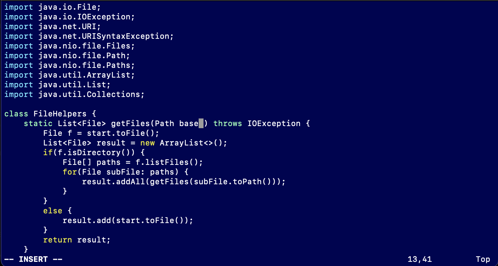
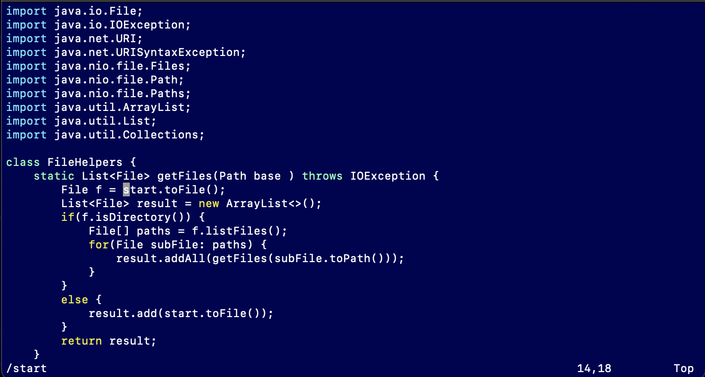
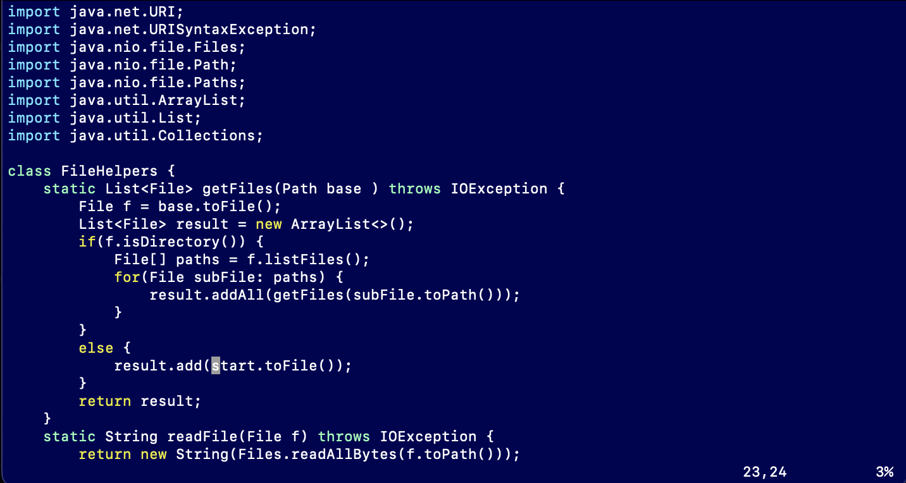
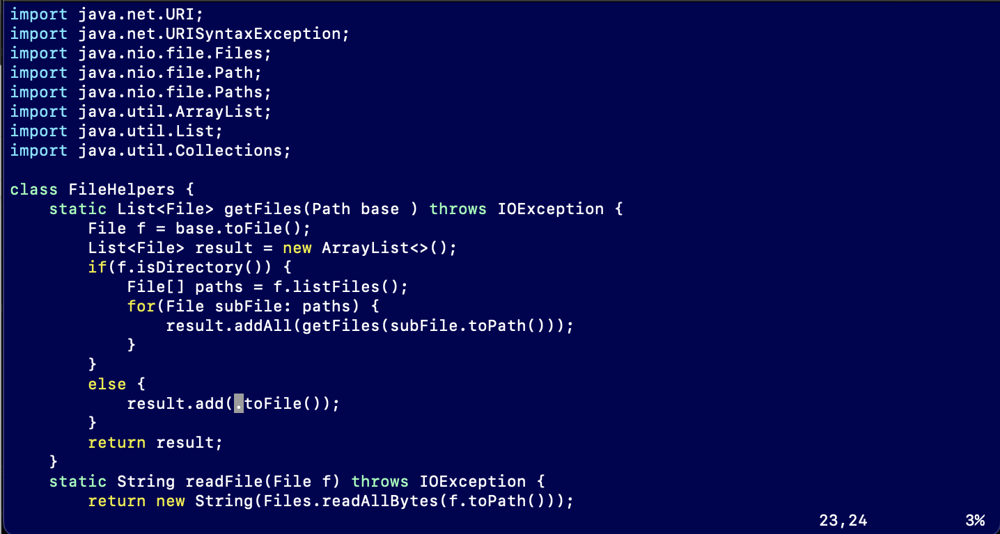
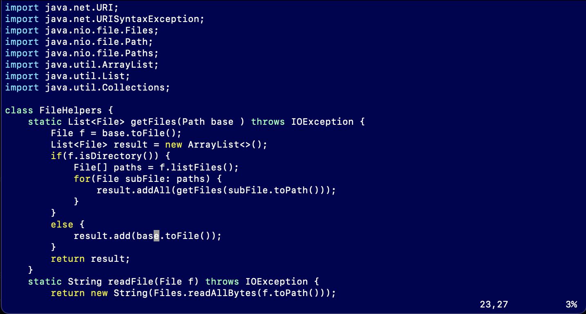
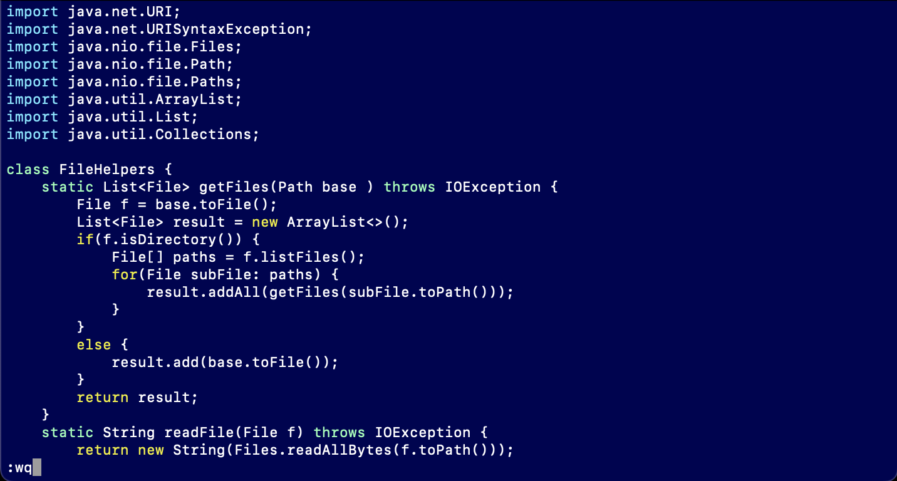

# week 7 lab report

## Part 1
* The task that I chose to do is to change all of the start variable names to base. To start editing, I used the command vim DocSearchServer.java
* in vim, my first comman was /start <Enter>. This brought me to the first instance of the word start

* next I used dw to delete the word start

* then I used i to enter insert mode, then typed base to write base into the file as the new variable name.

* <Escape> got me back into normal mode. Then n brought me to the next instance of the word start. n in vim is used to repeat the last search

* again I deleted the word with dw

* then used i to enter insert mode and typed out base to replace the variable name.

* <Escape> got me back into normal mode then n got me to the next instance of the word start. dw deleted the word start

* i entered insert mode, then i typed base to replace the variable name

* to save and exit the file, I typed :wq <Enter>

  
## Part 2
  * Next I compared the speed of edits onto a remote server using vim compared to making the edits locally then using scp to transfer the file onto the remote server 
  
  * First I tried making an edit in VS Code then using scp to transfer the edit onto the remote, then running the file in the remote.  The edit I made was to comment out the java command, so the file just compiled instead of compiling and running. This took me 57 seconds.
  
  
  * Second I tried making that same edit onto the file while already in my remote account by using vim. I then ran the file. In total this only took me 14 seconds. 
  
  
  
